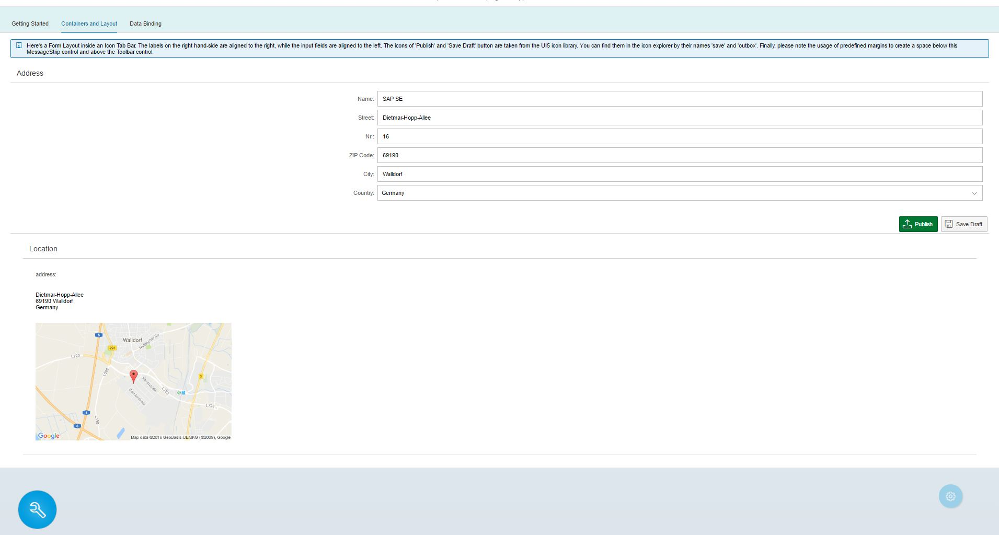

# opesapui5-myapp
Training App from openSAP course 2016 - Developing Web Apps with SAPUI5

Contributions
-------------

All content is published under the Apache 2.0 license.
For more information check the LICENSE.txt file

If you spot any issues with the code or found a bug, please create an issue or a pull request and we will take care of it

Thank you,

The ui51 course team
